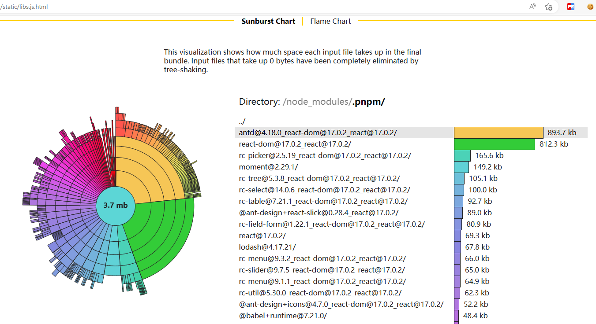

# f2e-middle-esbuild
f2e-server middleware for esbuild

## install
- `npm i --save-dev f2e-server f2e-middle-esbuild`
- `cp ./node_modules/f2e-middle-esbuild/.esbuildrc.js`

## config
`.f2econfig.js` 中添加:
```js
module.exports = {
    ...
    middleware: [
        ...
        {
            middleware: 'esbuild',
            // 针对哪些文件监听修改
            watches: [/\.[jet]?sx?$/],
        }
    ]
}
```

## options
`.esbuildrc.js` 参考 [esbuild.ts](https://github.com/evanw/esbuild/blob/master/lib/types.ts#L27) and [esbuild.md](https://github.com/evanw/esbuild#command-line-usage)
```js
// @ts-check

/**
 * @type { import('f2e-middle-esbuild').BuildOptions }
 */
let config = [
{
    sourcemap: true,
    treeShaking: false,
    entryPoints: {
        libs: 'src/index.libs.tsx',
    },
    outdir: 'static',
    target: 'chrome70',
    bundle: true,
    format: 'iife',
    globalName: '__LIBS__',
    loader: {
        '.tsx': 'tsx',
        '.ts': 'ts',
    },
    tsconfig: './tsconfig.json',
},{
    sourcemap: 'external',
    external: [
        'serve/interface.ts',
        'react',
        'react-dom',
    ],
    inject: ['src/inject.js'],
    entryPoints: {
        index: 'src/index.tsx'
    },
    target: 'esnext',
    jsxFactory: 'React.createElement',
    bundle: true,
    format: 'iife',
    loader: {
        '.tsx': 'tsx',
        '.ts': 'ts'
    },
    tsconfig: './tsconfig.json',
},
];

module.exports = config
```

## 三方库分包
`src/index.libs.ts`
```ts
import * as React from 'react'
import * as ReactDOM from 'react-dom'
import * as Antd from 'antd'
module.exports = {
    'react': React,
    'react-dom': ReactDOM,
    'antd': Antd,
}
```
`src/inject.js`
```js
require = (moduleName) => {
    const mod = window['__LIBS__'][moduleName]
    if (!mod) {
        console.log(moduleName)
    }
    return mod
}
```
`index.html`
```html
<html>
    <body>
        <script src="/static/libs.js?v1.0.0"></script>
        <script src="/static/bundle.js?v1.0.0"></script>
    </body>
</html>
```

## Bundle Size Analyzer
访问 [http://localhost:2850/static/libs.js.html](http://localhost:2850/static/libs.js.html)
看到如下图：
